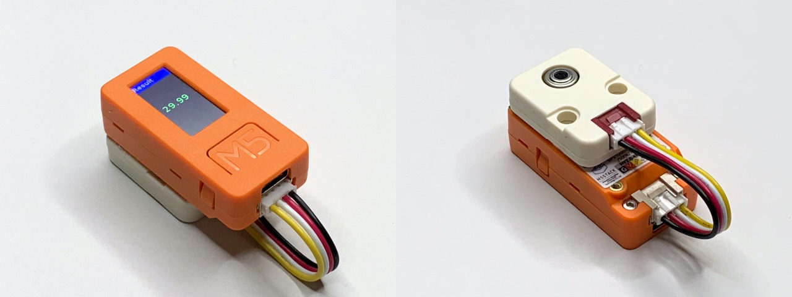
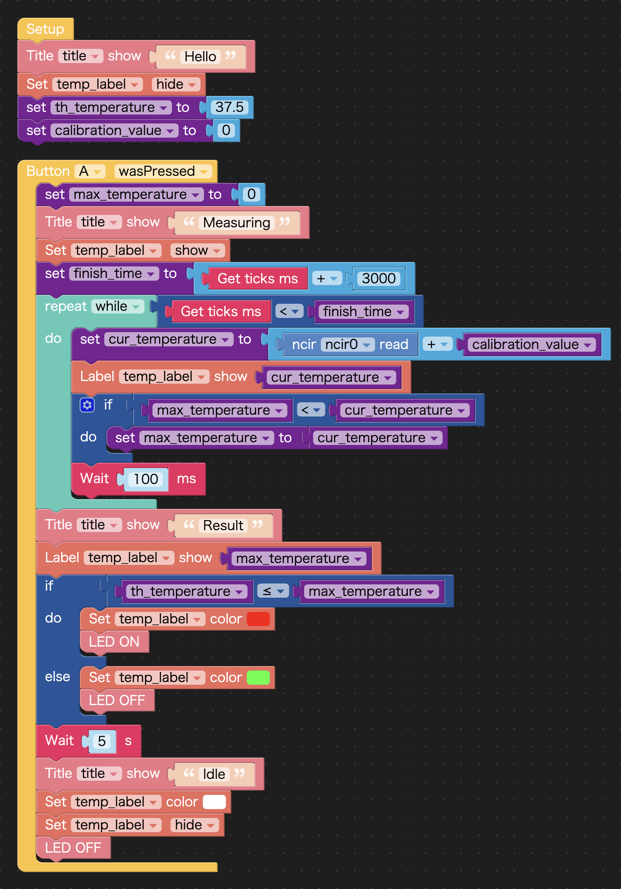

# DIY Forehead Thermometer Using M5StickC

## How to make

### Components

- [M5StickC](https://docs.m5stack.com/#/en/core/m5stickc) by M5Stack: 1
- [NCIR](https://docs.m5stack.com/#/en/unit/ncir) by M5Stack: 1

### Usage

1. Move the NCIR (non-contact infrared temperature sensor) closer to the forehead of the person being measured so that the distance is within 5 cm.
2. Press the A button on the M5StickC.
3. Wait for 3 seconds and read the value displayed on the M5StickC display.

### Notes

Calculate the difference between the value measured under the same conditions using a commercially available calibrated non-contact infrared thermometer, and set the value to `calibration_value`. For example, if the reference thermometer shows 36.5°C and your thermometer shows 35.8°C, then 36.5 - 35.8 = 0.7 is the value to be set.

Note that a non-contact infrared thermometer can only measure the temperature of the body surface, which is different from the actual body temperature. For this reason, it should only be used to screen out people who have a high body temperature and measure accurate body temperature in their armpits using a contact-type thermometer.

## References

- [DIY Micro:bit Infrared Thermometer Workshop](https://github.com/clab-cetm/DIY-Thermometer-Using-Microbit) by [Taiwan Contemporary Culture Lab (C-LAB)](https://clab.org.tw/en/)

# M5StickC でつくる自家製額温度計

## 作り方

### 用意するもの

- M5Stack の[M5StickC](https://docs.m5stack.com/#/en/core/m5stickc)：1
- M5Stack の[NCIR](https://docs.m5stack.com/#/en/unit/ncir)：1

### 使い方

1. NCIR（非接触型赤外線温度センサ）と計測対象者の額の距離が 5 センチ以内になるよう近づける
2. M5StickC の A ボタンを押す
3. 3 秒間そのまま待ち、M5StickC のディスプレイに表示された値を読み取る

### 注意点

市販されている校正済の非接触型赤外線温度計を用いて同一の条件で計測した値との差分を求め、その値を`calibration_value`にセットしてください。例えば、基準として用いる温度計が 36.5℃ を示したのに対して自分の温度計が 35.8℃ を示したのであれば、36.5 - 35.8 = 0.7 がセットすべき値です。

なお、非接触型赤外線温度計で計測できるのはあくまで体表面の温度であり、実際の体温とは異なります。このため、あくまで明らかに体温が高い人を選別する目的のみに使用し、正確な体温は接触型の体温計を用いて脇の下で計測しましょう。

## リファレンス

- [Taiwan Contemporary Culture Lab (C-LAB)](https://clab.org.tw/en/)による[DIY Micro:bit Infrared Thermometer Workshop](https://github.com/clab-cetm/DIY-Thermometer-Using-Microbit)
